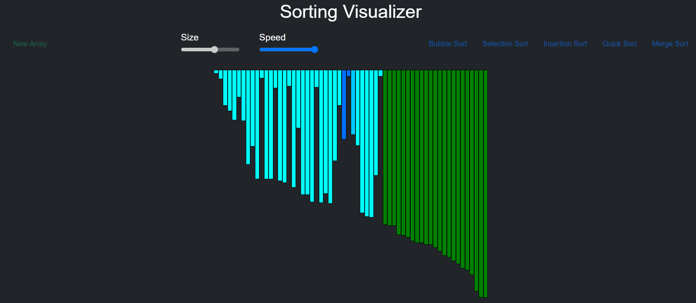
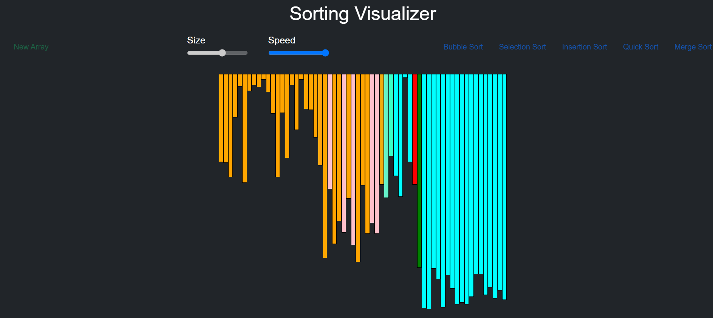
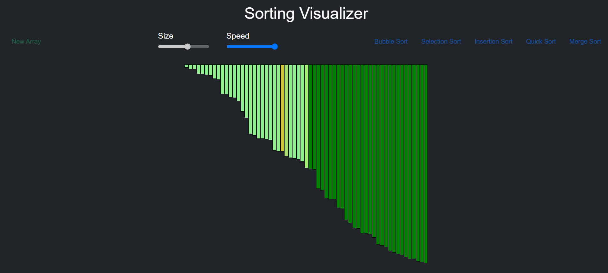

### This is a sorting algoritm visualization project made using javascript, Css and HTML
### The Algorithms that could be visualized in this project include the following :  
- Bubble Sort 
- Selection Sort
- Insertion Sort
- Quick Sort
- Merge Sort

### In this project I have used Html to make the skeleton of the main page, used external CSS for styling the page and have used Java Script for the desining the main functions for the website . I have finally hosted the website on github using the pages function and the live link for the website is :   

These are some of the images from the project for your reference in case you dont have time to visit the link.
We could select the size for the array and the choose any of the sorting methods to start the algorithm and then simply watch the algorithm sorting the randomly created array of that perticular size.
  
  
  
 

I hope you liked the project.

Shivank shukla IIT Bhilai